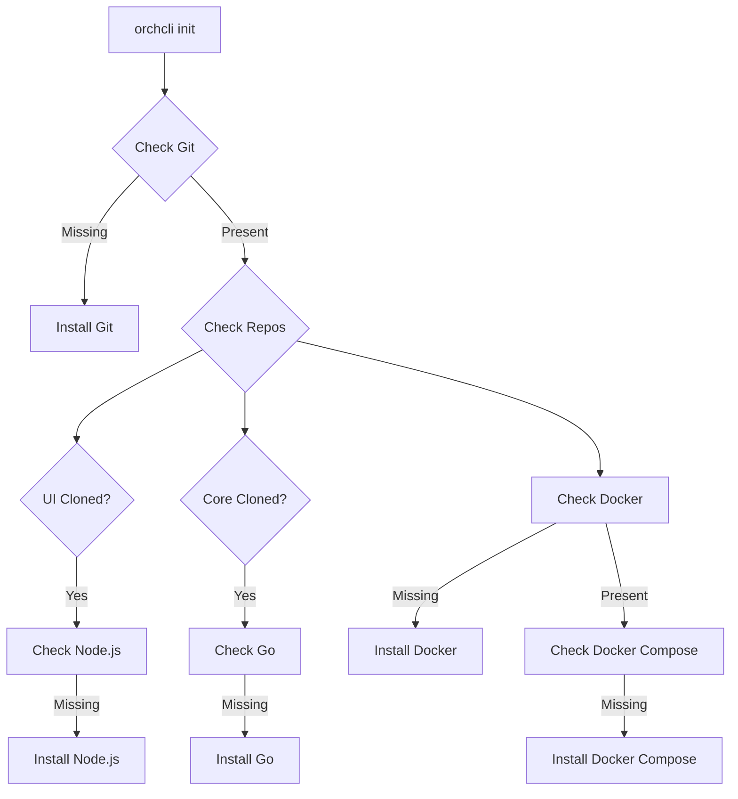

# OrchCLI Architecture

## Overview

OrchCLI is designed to provide the optimal development experience for different types of developers working on the KubeOrchestra platform. It intelligently adapts based on what repositories are cloned locally.

## Core Principles

1. **Developer-Centric**: Different setups for frontend, backend, and full-stack developers
2. **Minimal Dependencies**: Only install what's necessary for your workflow
3. **Smart Defaults**: Automatically detect and configure based on cloned repos
4. **Hot Reload Everything**: All development modes support hot reload

## Architecture Modes

### 1. Production Mode
**When:** No repositories cloned
**Purpose:** Testing with production images

```
┌─────────────────────────────────────────┐
│           Docker Network                 │
│                                          │
│  ┌──────────┐  ┌──────────┐  ┌────────┐│
│  │PostgreSQL│  │   Core   │  │   UI   ││
│  │  :5432   │◄─│  :3000   │◄─│ :3001  ││
│  └──────────┘  └──────────┘  └────────┘│
│                                          │
└─────────────────────────────────────────┘
         ▲             ▲            ▲
         │             │            │
    localhost:5432  localhost:3000  localhost:3001
```

### 2. Full Development Mode
**When:** Both UI and Core repositories cloned
**Purpose:** Full-stack development

```
┌──────── Host Machine ────────┐  ┌─── Docker ───┐
│                              │  │              │
│  ┌────────┐      ┌────────┐ │  │ ┌──────────┐│
│  │   UI   │─────►│  Core  │ │  │ │PostgreSQL││
│  │  :3001 │      │  :3000 │─┼──┼►│  :5432   ││
│  └────────┘      └────────┘ │  │ └──────────┘│
│   npm run dev       air      │  │              │
└──────────────────────────────┘  └──────────────┘
```

### 3. Frontend Development Mode
**When:** Only UI repository cloned
**Purpose:** Frontend development without backend setup

```
┌──────── Host Machine ────────┐  ┌────── Docker Network ──────┐
│                              │  │                            │
│         ┌────────┐           │  │ ┌──────────┐  ┌────────┐ │
│         │   UI   │───────────┼──┼►│   Core   │◄─│Postgres│ │
│         │  :3001 │           │  │ │  :3000   │  │  :5432 │ │
│         └────────┘           │  │ └──────────┘  └────────┘ │
│         npm run dev          │  │   (image)                 │
└──────────────────────────────┘  └────────────────────────────┘
```

### 4. Backend Development Mode
**When:** Only Core repository cloned
**Purpose:** Backend development without frontend setup

```
┌─────────────────── Docker Network ────────────────────┐
│                                                        │
│  ┌──────────┐  ┌─────────────────┐  ┌──────────┐    │
│  │PostgreSQL│◄─│   Core          │◄─│    UI    │    │
│  │  :5432   │  │  :3000          │  │   :3001  │    │
│  └──────────┘  │ (mounted volume)│  └──────────┘    │
│                └─────────────────┘    (image)        │
│                  ▲                                    │
└──────────────────┼────────────────────────────────────┘
                   │
            ┌──────┴──────┐
            │ Host Machine│
            │  Core code  │
            │  (mounted)  │
            └─────────────┘
```

## Key Design Decisions

### 1. Asymmetric Hybrid Modes

The hybrid modes are intentionally different:

- **Frontend Mode**: UI runs on host because frontend developers are comfortable with Node.js/npm
- **Backend Mode**: Core runs in container (with mounted code) so backend developers don't need Go installed

This asymmetry is a feature, not a bug. It optimizes for each developer's workflow.

### 2. Network Strategy

- **Production**: Everything in Docker network
- **Full Dev**: Everything on localhost
- **Frontend Dev**: Mixed (UI on host, rest in Docker)
- **Backend Dev**: Everything in Docker network (simpler than host-to-container networking)

### 3. Hot Reload Implementation

- **UI**: Uses Next.js built-in hot reload (`npm run dev`)
- **Core**: Uses Air for Go hot reload
- **Mounted volumes**: Changes on host immediately visible in container

## Docker Compose Files

| File | Mode | Services |
|------|------|----------|
| `docker-compose.prod.yml` | Production | All in Docker |
| `docker-compose.dev.yml` | Full Dev | Only PostgreSQL |
| `docker-compose.hybrid-ui.yml` | Frontend Dev | PostgreSQL + Core |
| `docker-compose.hybrid-core.yml` | Backend Dev | All in Docker |

## Port Mappings

| Service | Internal Port | Host Port | Notes |
|---------|--------------|-----------|-------|
| PostgreSQL | 5432 | 5432 | Always in Docker |
| Core API | 3000 | 3000 | Host or Docker |
| UI | 3001 | 3001 | Host or Docker |

## Environment Variables

### Core Service
- `DB_HOST`: `postgres` (Docker) or `localhost` (host)
- `DB_PORT`: `5432`
- `DB_NAME`: `kubeorchestra`
- `DB_USER`: `kubeorchestra`
- `DB_PASSWORD`: `kubeorchestra`

### UI Service
- `NEXT_PUBLIC_API_URL`: Browser-accessible API URL
- `API_URL`: Server-side API URL (for SSR)
- `PORT`: `3001`

## Auto-Installation Flow



## Benefits of This Architecture

1. **No Unnecessary Dependencies**: Backend devs don't need Node.js, frontend devs don't need Go (in hybrid mode)
2. **Familiar Workflows**: Developers work the way they're used to
3. **Fast Iteration**: Hot reload for all scenarios
4. **Simple Networking**: Avoid complex host-to-container networking where possible
5. **Flexible**: Easy to switch between modes

## Future Improvements

1. **DevContainers**: Full IDE integration with VS Code DevContainers
2. **Cloud Development**: Support for GitHub Codespaces / Gitpod
3. **Multi-tenant**: Support multiple projects simultaneously
4. **Custom Networks**: Allow custom network configurations
5. **Service Mesh**: Optional Istio/Linkerd integration for production-like development